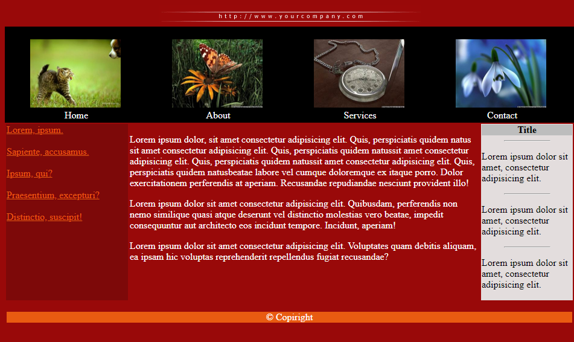

## Сверстать веб-страницу по предложенному макету:

## Требования к вёрстке:
* все картинки отображаются
* наличие атрибута alt у тега img
* использовано минимум 2 семантических тега
* размер шрифта для текста 18px
* размер шрифта для подвала 20px
* цвет нужно брать при помощи pixie
